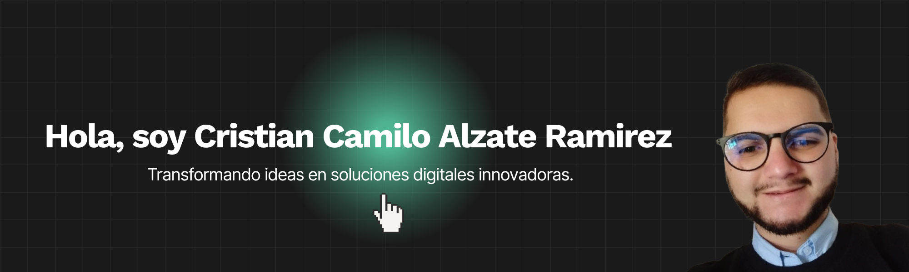

# Sobre Mi

Mi nombre es Cristian Camilo Alzate Ramírez, desarrollador de software independiente. Aprendí de forma autodidacta y encontré en la tecnología, la informática y las matemáticas una pasión que hoy transformo en ideas, aportando soluciones digitales innovadoras.

Con más de dos años de experiencia en desarrollo web construyendo aplicaciones web y colaborando con empresas, agencias y emprendedores. Si buscas un profesional que piense como desarrollador, actúe como emprendedor y se comprometa como parte de tu equipo, aquí estoy. ¡Cuenta conmigo!

### 🛠️ Conjunto de Habilidades

| **Frontend** | **Backend** | **Herramientas** |
|--------------|-------------|------------------|
|         |       |          |


### 📊 Durante esta semana, he invertido mi tiempo en:

```txt
React                4 hrs 08 mins    ▓▓▓▓▓▓▓▓░░░░░░░░░░░░   40 %
Tailwind CSS         3 hrs 06 mins    ▓▓▓▓▓▓░░░░░░░░░░░░░░   30 %
Figma                2 hrs 04 mins    ▓▓▓▓░░░░░░░░░░░░░░░░   20 %
Git                  1 hrs 50 mins    ▓▓░░░░░░░░░░░░░░░░░░   10 %
```

---

✨ **¡Gracias por visitar mi perfil!** 🎉
