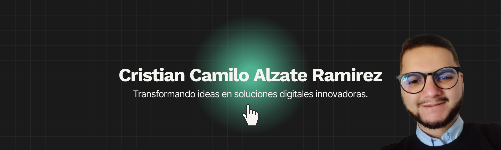

## 💼 Sobre mí

Mi nombre es **Cristian Camilo Alzate Ramírez**, desarrollador de software colombiano. Autodidacta, descubrí en la tecnología, la informática y las matemáticas una pasión que hoy transformo en ideas y soluciones digitales innovadoras.  
Con más de dos años de experiencia, he creado proyectos web y automatizaciones con IA para empresas, agencias y particulares.  
Mi enfoque va más allá de escribir código y plasmar diseños: **busco aportar una visión innovadora y emprendedora en cada proyecto.**

Disfruto el aprendizaje constante, lo que me impulsa a crecer, crear y superarme día a día.  
Si buscas un profesional que piense como desarrollador, actúe como emprendedor y se comprometa como parte de tu equipo, aquí estoy para colaborar y construir contigo.

---

## 🚀 Qué hago

✨ **Desarrollo software con propósito.**  
🌱 **Transformo ideas en proyectos sostenibles.**  
💡 **Aplico tecnología para impulsar negocios y comunidades.**

---

## 🛠️ Stack Tecnológico

| **Frontend** | **Backend** | **Herramientas** |
|--------------|-------------|------------------|
|      |       |     |

---

## 📫 Conecta conmigo

- 💼 [LinkedIn](https://linkedin.com/in/cristiancamiloalzateramirez)  
- 🌍 [Sitio Web](https://criscamideas.com)  
- 📨 [Email](mailto:ccalzateramirez@gmail.com)  

---

### 🌱 “Construyo empresas, software y comunidad.” 🧑🏻‍💻🤝
✨ Gracias por visitar mi perfil, ¡el futuro se construye creando!
